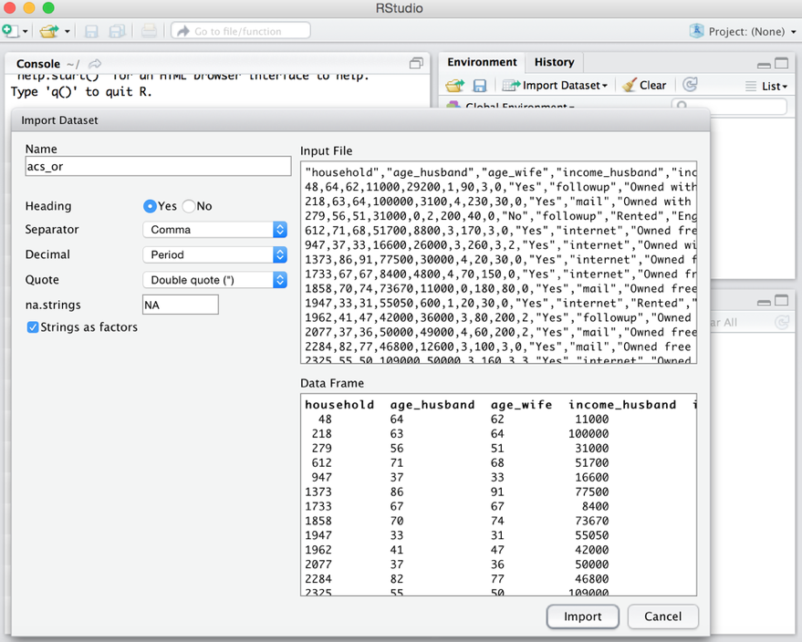

# Data import

## Step 1: Prepartion

You need to first make sure that your data is well prepared to be imported. Here’s a list of some best practices 
to help you to avoid any issues with reading your Excel files and spreadsheets into R:

- The first row of the spreadsheet is usually reserved for the header, while the first column is used to identify 
the sampling unit.
- Avoid names, values or fields with blank spaces, otherwise each word will be interpreted as a separate variable, 
resulting in errors that are related to the number of elements per line in your data set.
- If you want to concatenate words, do this by inserting a `.`. For example: `Sepal.Length`
- Short names are prefered over longer names.
- Try to avoid using names that contain symbols such as `?`, `$`,`%`, `^`, `&`, `*`, `(`, `)`,`-`,`#`,`?`,`,`,`<`,`>`, `/`, `|`, `[` ,`]`,`{`, and `}`.
- Delete any comments that you have made in your Excel file to avoid extra columns or `NA`’s to be added to your file.
- Make sure that any missing values in your data set are indicated with `NA`.

## Step 2: The Working directory

Once you have your spreadsheets saved, you still need to set your working directory in R. R knows the directory it was 
started in, and refers to this as the `working directory`. With the following command you can check where your working 
directory is set at this moment:

```{r}
getwd() # get the current working directory
```

Then, it could be that you want to change the path that is returned in such a way that it includes the folder where you have stored your dataset:

```{r}
setwd("~/Desktop/Rintro") # set working directory to the folder you want to read in/out
```

By executing this command, R now knows exactly in which folder you’re working.

**NOTE**:
R is a UNIX based system, therefore data paths have to be specified using either `/` or `\\` (not like under windows with `\`).


## Step 3: Loading your spreadsheets 

### read.table()

One format for saving your data set in step 1 was the tab-delimited text file or `*.txt` file. If your data is saved as such, you can use one of the easiest and most general options to import your file to R: the `read.table()` function.

```{r}
dat.txt <- read.table("<FileName>.txt", header = TRUE)
```

- The second argument header is specified if the file has  names in the first line or top row (`TRUE` is the default value).

**NOTE**:
The field separator character is set to `""` or white space by default (**tab-delimited** `.txt` files). White spaces also indicate tabs, newlines or carriage returns. If your file uses another symbol to separate the fields of your data set (like e.g. `/`), indicate this by adding the sep argument.

```{r}
dat.txt <- read.table("<FileName>.txt", header = TRUE, sep="/")
```

### read.csv() and read.csv2()

- Special cases of the versatile `read.table()` function (differ only by the separator symbol).
- Frequently used to read spreadsheets saved with the extension `*.csv`. 
- `read.csv()` uses a comma, `read.csv2()` uses a semicolon.

```{r}
dat.csv <- read.csv("<FileName>.csv")
```

**NOTE**:
The `dec` argument allows you to specify the character for the decimal mark. Make sure to specify this for your file if necessary, otherwise your values will be interpreted as separate variables.

```{r}
dat.csv <- read.csv2("<FileName>.csv", dec = ",")
```

###  R-studio

- First download the spread sheet onto your local computer and use the import dataset feature of R Studio. 
- Step 1: Click on the **import** dataset button in the top-right section under the **environment tab**. Select the file you want to import and then click **open**. The import dataset dialog will appear as in the example shown below:



- Step 2: Setting up the preferences of separator, name and other parameters, click on the **import** button. The dataset will be imported in R Studio and assigned to the variable name as set before.

# Data inspection

- After executing the command to read in the file in which your data set is stored, you might want to check one last time to see if you imported the file correctly. 

Checking the structure of the data set

```{r}
facebook_data <- read.csv("~facebook_data.csv", sep=";")
```

```{r}
str(facebook_data)
```

Display the first observations of the data set

```{r}
head(facebook_data)
```

Display the last observations of the data set

```{r}
tail(facebook_data)
```

Checking the number of rows and number of columns of the data set

```{r}
dim(facebook_data)
```

Checking the column (variable) names of the data set

```{r}
colnames(facebook_data)
names(facebook_data)
```

Acessing a particular column

```{r}
facebook_data[,2]                      # accessing column 2 by it's position
facebook_data[,"academic.achievement"] # accessing column 2 by it's name
facebook_data$academic.achievement     # accessing column 2 by it's name
```

# Data processing

Calculating the mean of `academic.achievement`

```{r}
mean(facebook_data$academic.achievement)  
```

Calculating the median of `academic.achievement`

```{r}
median(facebook_data$academic.achievement)  
```

Calculating the minimum and maximum of `academic.achievement`

```{r}
min(facebook_data$academic.achievement)  
max(facebook_data$academic.achievement)  
```

Obtaining a summary statistic of the columns (variables) in the data set

```{r}
summary(facebook_data)
```

(Box)Plotting variables
```{r}
boxplot(facebook_data$amount.of.friends, col="grey", horizontal = TRUE)
```


(Scatter)Plotting variables
```{r}
plot(facebook_data$academic.achievement, facebook_data$hours.spent.on.facebook)
```

Alternative specification
```{r}
plot(hours.spent.on.facebook ~ academic.achievement, data=facebook_data)
```
