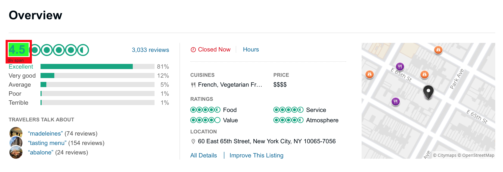
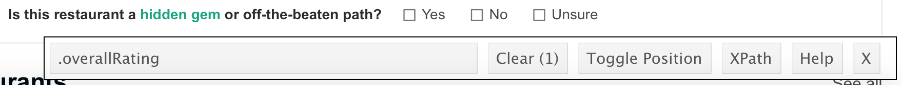

# What is Web Scraping?
  
* Web scraping is a process of extracting **unstructured** data from websites into a **structured** format eligible to 
perform further analysis on it.
* Complexity of the task ranges from crawling (dynamic web pages) to just grabbing a table of static data.

# Structured vs. unstructured data

* Typical examples for **structured data** are spreadsheets with a clearly defined format and structure.
* **Unstructured data** does not have a recognizable structure and can be non-textual or textual. It may contain data 
such as dates, numbers and a huge amoung of text (thus are a mix of structured and unstructured data).

**Example**: Email includes time, date, recipient and sender details and subject, etc., but an email body remains unstructured. 

# Grabbing static data

* `rvest`package: Simple tool for scraping tabular data.
* Scrapes data based on css elements in web pages.

```{r}
## Install rvest package
# install.packages("rvest")
## Load ‘rvest’ package
library(rvest)
```

* `read_html()`: Reading a html page by setting the URL of the page.
* `html_node()`: Specifying the part of the html document.
* `html_table()`: Extracting the data inside a table and converting it into a data frame.
* `html_text()`: Extracting the data as text (needs to be converted by hand).

## `html_table()`

**Example**: [Per capita beer consumption](https://en.wikipedia.org/wiki/List_of_countries_by_beer_consumption_per_capita)

Scraping the list of countries ordered by annual per capita consumption of beer.

1. Read the web page's whole html content

```{r}
beer <- read_html("https://en.wikipedia.org/wiki/List_of_countries_by_beer_consumption_per_capita")
# print out the html object (xml document)
beer
```

2. Convert the object to a table

```{r}
beer.table <- beer %>%
  html_table(fill=TRUE) # for cells with missing entries
# inspect the structure of beer.table
str(beer.table)
```

```{r}
# process only the first list entry
head(beer.table[[1]])
```

```{r}
# rename the beer.table columns
colnames(beer.table[[1]]) <- c("GlobalRank","Country","PerCapitaConsumption", "Change", "NationalConsumption", "Year")

library(ggplot2)
ggplot(beer.table[[1]][1:10,], aes(x=Country, y=PerCapitaConsumption)) +
  geom_bar(stat="identity", fill="steelblue") +
  geom_text(aes(label=PerCapitaConsumption), vjust=1.6, color="white", size=3.5) +
  theme(axis.text.x = element_text(angle = 90, hjust = 1, size=10.5))
```

## `html_text()`

**Example**: TripAdvisor 

Scrapeing information on [restaurants in New York](https://www.tripadvisor.com/Restaurant_Review-g60763-d457808-Reviews-Daniel-New_York_City_New_York.html).

1. Read the web page's whole html content

```{r}
daniels <- read_html("https://www.tripadvisor.com/Restaurant_Review-g60763-d457808-Reviews-Daniel-New_York_City_New_York.html")
# print out the html object (xml document)
daniels
```

2. Scrape the restaurant details  

* Finding the unique identifier key by using the browser plugin **https://selectorgadget.com**. 
* Open the web page to be scraped (Chrome: click on the plugin to enable it, Safari: click the selectorgadet on the `favorites list).
* Try to select the corresponding content area by using the mouse cursor (click to set it).

* Use the class name shown at the bottom to identify the content area uniquely.


Scrape the number of reviews and the overall rating.

```{r}
reviews <- daniels %>%                             # store the result in an object named reviews
  html_nodes(".seeAllReviews, .overallRating") %>% # key identifiers for no. of reviews and overall rating 
     html_text()
reviews
```

The no of reviews included in the reviews object requires some further processing to turn the character expression into a numeric value.

```{r}
reviews[[2]]                        # the element to be processed
strsplit(reviews[[2]], " ")         # split the character into two characters by the blank space
strsplit(reviews[[2]], " ")[[1]]    # result is a list with one entry. We want to work on this entry
strsplit(reviews[[2]], " ")[[1]][1] # the first element of the first list entry is selected for further processing

no.reviews <- strsplit(reviews[[2]], " ")[[1]][1] 
no.reviews <- as.numeric(gsub(",", "", no.reviews))  # substitute the "," by nothing.
no.reviews
```

Scraping the ratings.

```{r}
ratings <- daniels %>%         # store the result in an object named ratings
  html_nodes(".row_cell") %>%  # key identifier for the ratings table
    html_text()
ratings
```

Same here, the ratings require some further processing.

```{r}
label <- ratings[seq(1,length(ratings),by = 3)]     # select the value labels from the vector (create a vector of indices for every third element starting from element 1 and running through the last element)
label

num.rating <- ratings[seq(3,length(ratings),by = 3)] # select the rating values from the vector (create a vector of indices for every third element starting from element 3 and running through the last element)
num.rating

num.rating <- as.numeric(gsub("%", "", num.rating))  # substitute the "%" by nothing.
num.rating

# built dataframe
data.frame(label,num.rating)
```

# Exercises

**Exercise 1**: Obtain the opening hours for *Daniel's*.

```{r}
OH <- daniels %>%                             # store the result in an object named reviews
  html_nodes(".allHoursCTA") %>%              # key identifier for opening
    html_text()
OH
```

**Exercise 2**: Repeat the analysis for *2 nearby restaurants*.

Match 65 Brasserie
```{r}
brasserie <- read_html("https://www.tripadvisor.com/Restaurant_Review-g60763-d1318706-Reviews-Match_65_Brasserie-New_York_City_New_York.html")

reviews.b <- brasserie %>%                             
  html_nodes(".seeAllReviews, .overallRating") %>%
    html_text()

reviews.b
```

```{r}
ratings.b <- brasserie %>%      
  html_nodes(".row_cell") %>%  
    html_text()
ratings.b
```

Vaucluse
```{r}
vaucluse <- read_html("https://www.tripadvisor.com/Restaurant_Review-g60763-d8602236-Reviews-Vaucluse-New_York_City_New_York.html")

reviews.v <- vaucluse %>%                             
  html_nodes(".seeAllReviews, .overallRating") %>%
  html_text()

reviews.v
```

```{r}
ratings.v <- vaucluse %>%      
  html_nodes(".row_cell") %>%  
  html_text()
ratings.v
```

**Exercise 3**: Compare the average ratings of all three restaurants graphically in a boxplot. 

```{r}
# Ratings of Brasserie
num.rating.b <- ratings.b[seq(3,length(ratings.b),by = 3)] 
num.rating.b <- as.numeric(gsub("%", "", num.rating.b)) 
num.rating.b

# Ratings of Vaucluse
num.rating.v <- ratings.v[seq(3,length(ratings.v),by = 3)] 
num.rating.v <- as.numeric(gsub("%", "", num.rating.v)) 
num.rating.v

# built dataframe
all.data <- data.frame(label,num.rating, num.rating.b, num.rating.v)
colnames(all.data) <- c("Label","Daniels","Brasserie","Vaucluse")
all.data
```

```{r}
# note: for ggplot we need to order the labels (as factors)
factor(all.data$Label, levels=all.data$Label)
# we override this in all.data
all.data$Label <- factor(all.data$Label, levels=all.data$Label)

# use gather() to make the wide all.data longer
library(tidyr)
gather(data = all.data, key = Restaurant, value = Rating, Daniels:Vaucluse, -Label) %>%  # pipe the result directly into ggplot
  ggplot(aes(x=Label, y=Rating, fill=Restaurant)) +
  geom_bar(stat="identity", position=position_dodge()) +
  scale_fill_brewer(palette="Blues") +
  theme_minimal()
```
